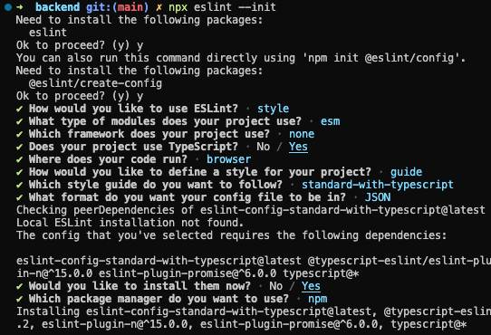

# Roteiro para as mentorias do Cookmaster

Sequência de mentorias desenvolvidas para serem aplicadas na Turma 25, com o propósito de revisar e reforçar conteúdos nos quais as pessoas estudantes posuem dificuldades, esses conteúdos foram apontados pelas próprias pessoas estudantes no preenchimento [deste forms](https://forms.gle/6EdTi8LecdZVUiyt9), o resultado desse forms pode ser verificado [aqui](https://betrybe.slack.com/archives/C03N2F2FGKA/p1680096291916419?thread_ts=1680016591.667539&cid=C03N2F2FGKA).

Esse projeto vai ser desenvolvido do 0, desde da criação dos diretórios iniciais, até o deploy das aplicações totalmente funcionais e será um projeto Fullstack.

O ideal é que os momentos sejam iniciados e finalizados na mesma mentoria, é possível que dependendo do tempo da mentoria, só seja possível realizar 1 momento por mentoria, mas caso tenha tempo para finalizar mais de 1 momento, fique a vontade para tocar quantos momentos forem cabíveis, desde que iniciem e finalizem em uma mesma mentoria, para não perder a linearidade nem o raciocínio.

# Primeiro momento - Configurando o projeto

Visto que o projeto vai ser desenvolvido do 0, é bom mostrar para as pessoas estudantes o que nós iremos desenvolver, para isso, podemos usar um rascunho do que será desenvolvido **Inserir links do Excalidraw e Figma**.

> OE: fale sobre o fluxo de receitas, que iremos fazer um CRUD completo da rota /recipes, fale das tabelas esquematizadas, que iremos criar uma tabela somente para receitas, uma somente para os ingredientes e uma tabela intermediária entre essas 2.

<strong>Configurações iniciais</strong>

> OE: Abra o VSCode em um diretório vazio que você escolher para utilizar na mentoria, a sugestão é que o nome desse diretório seja Cookmaster

1. Faça a conexão do seu diretório local com o repositório no github onde você irá disponibilizar o código para as PEs:

~~~bash
git remote add triboA git@github.com:tryber/sd-0XX-a-live-lectures.git
git remote add triboB git@github.com:tryber/sd-0XX-b-live-lectures.git
~~~

> OE: É possível que surjam dúvidas sobre essa adição de remotos, tire um tempo para possíveis dúvidas, explique que é possível adicionarmos vários remotos nos nossos projetos, e que o *alias* do `origin` é somente o padrão. Utilize o comando `git remote -v` para exibir os remotos desse projeto.

2. Criar os diretórios para iniciar a criação da aplicação:

~~~bash
mkdir backend frontend
~~~

3. Entre no diretório do frontend e inicie uma aplicação `React`:

~~~bash
cd frontend
npx create-react-app .
~~~

> OE: Mostre a aplicação rodando no navegador e depois encerre a aplicação por enquanto utilizando o Ctrl + C

4. Entre no diretório do backend e inicie uma aplicação `Node.js`:

~~~bash
cd ../backend
npm init -y 
~~~

> OE: Mostre o arquivo package.json, mostre que foi criado com somente 1 script e que não possui nenhuma dependência instalada ainda.

5. Instale algumas dependências

> OE: Peça colaboração das PEs para determinar quais dependências serão instaladas

~~~bash
npm i express mysql2 sequelize
~~~

> OE: Mostre novamente o package.json e mostre que as dependências foram instaladas

6. Instale dependências de desenvolvimento

~~~bash
npm i -D typescript @types/express @types/node @types/sequelize ts-node-dev nodemon
~~~

7. Inicie a configuração do eslint:

~~~bash
npx eslint --init
~~~

> OE: Utilize as configurações abaixo:

8. Adicione novas configurações ao arquivo `.eslintrc.json`

> OE: Utilize as configurações [desse arquivo](./backend/.eslintrc.json)

9. Crie o arquivo `.eslintignore`

~~~bash
touch .eslintignore 
~~~

10. Adicione as seguintes linhas ao `.eslintignore`:

~~~.eslintignore
nyc.config.js
node_modules/
tests/
build/
src/database/migrations
src/database/seeders
src/database/config
src/database/models/index.ts
~~~

> OE: É possível que algumas dúvidas surjam sobre o motivo de estarem sendo adicionados aqui diretórios que ainda não existem e como você sabe que serão esses, diga que é por experiências prévias e que se for necessário, você pode alterar esse arquivo, removendo ou adicionando novos diretórios.

11. Crie o arquivo `.gitignore`:

~~~bash
touch .gitignore
~~~

12. Adicione o diretório `node_modules` ao arquivo `.gitignore`:

~~~.gitignore
node_modules
~~~

<strong>Iniciando o Backend</strong>

Visto que a base do frontend já foi criada com o comando `npx create-react-app .`, vamos somente criar os arquivos de inicialização do backend.

> OE: Os comandos a seguir estarão considerando que o seu terminal esteja dentro do diretório `backend`

1. Crie o arquivo `tsconfig.json`:

~~~bash
touch tsconfig.json
~~~

2. Adicione as seguintes configurações no arquivo `tsconfig.json`:

~~~json
{
  "compilerOptions": {
    "module": "commonjs",
    "target": "es6",
    "rootDir": "./src",
    "outDir": "./dist",
    "esModuleInterop": true,
    "strict": true
  }
}
~~~

3. Crie o diretório `src`:

~~~bash
mkdir src
~~~

4. Crie os arquivos `server.ts` e `app.ts`:

~~~bash
touch src/server.ts src/app.ts
~~~

5. Adicione o seguinte código no arquivo `app.ts`:

~~~typescript
// app.ts
import express, { Request, Response } from 'express';

const app = express();

app.use(express.json());

app.get('/', (_req: Request, res: Response) => {
  res.status(200).send('A API tá on!');
});

export default app;
~~~

6. Adicione o seguinte código no arquivo `server.ts`:

~~~typescript
// server.ts
import app from './app';

const PORT = process.env.APP_PORT || 3001;

app.listen(PORT, () => {
  console.log(`Server is running at PORT: ${PORT}`);
});
~~~

7. Adicione os seguintes scripts no arquivo `package.json`:

~~~json
// ...
  "dev": "nodemon --watch \"./src/**\" ./src/server.ts",
  "tsnd": "tsnd ./src/server.ts",
  "start": "npm run build && node ./dist/index.js",
  "build": "tsc"
// ..
~~~

8. Rode a aplicação usando o script `dev`:

~~~bash
npm run dev
~~~

9. Faça uma requisição para a rota `/`:

~~~http
localhost:3001/
~~~

> OE: Mostre a resposta da requisição e que é exatamente o que nós colocamos pra retornar no arquivo `app.ts`, depois disso pare a aplicação utilizando Ctrl + C.

10. Rode a aplicação usando o script `tsnd`:

~~~bash
npm run tsnd
~~~

> OE: Faça novamente a requisição para a rota `/` e mostre que a resposta foi a mesma, o ponto aqui é mostrar que dá pra usar 2 recursos diferentes para rodar nossas aplicações, mas que o resultado é o mesmo. Fique a vontade caso queira modificar o arquivo `app.ts` e mostrar os servidores recarregando. A partir daqui você escolhe qual dos 2 scripts você irá usar.

> OE: Final do primeiro momento. Tire dúvidas e deixe aberto para interação das PEs.
> Se tiver tempo para o começar e terminar o próximo momento, execute-o, se não, encerre a mentoria dando um leve spoiler do que será visto na próxima mentoria.

~~~typescript

~~~

<strong></strong>

~~~bash

~~~
